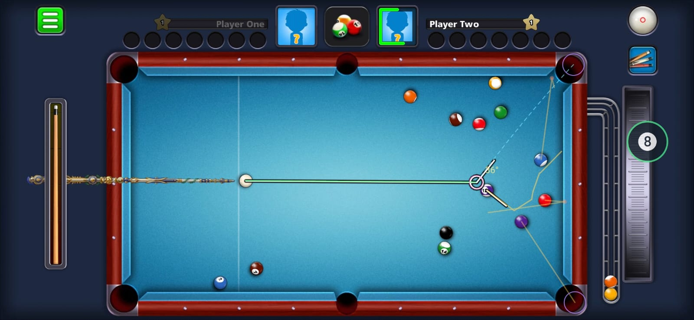
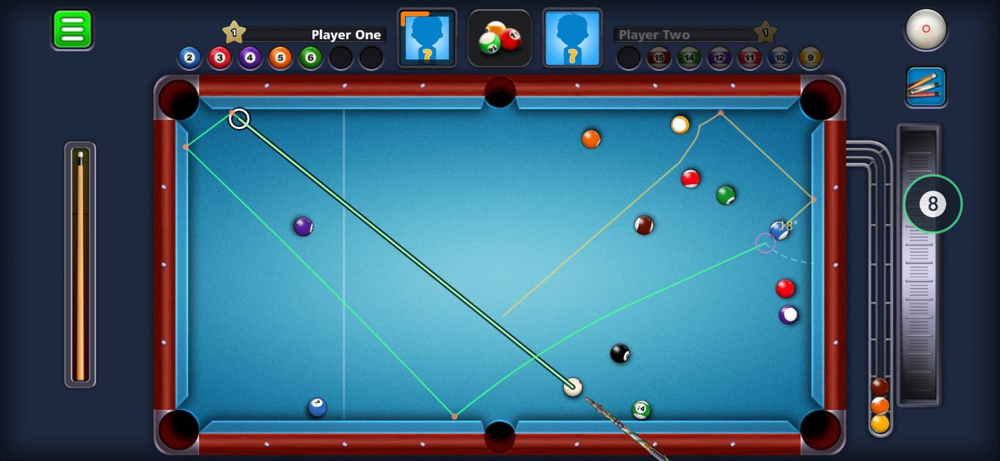
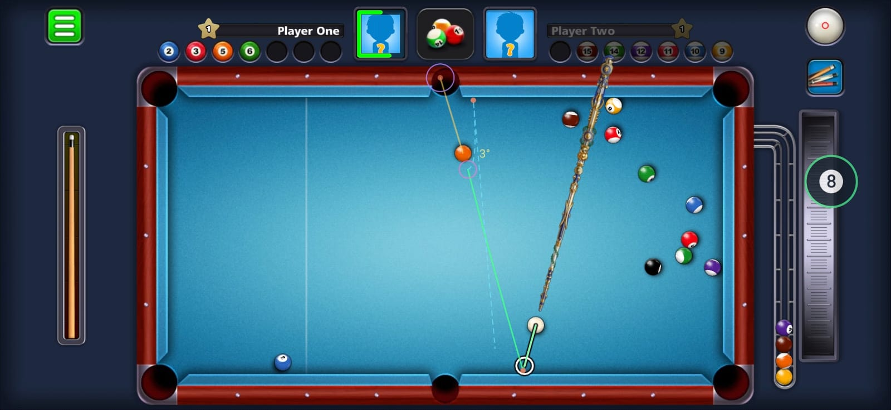
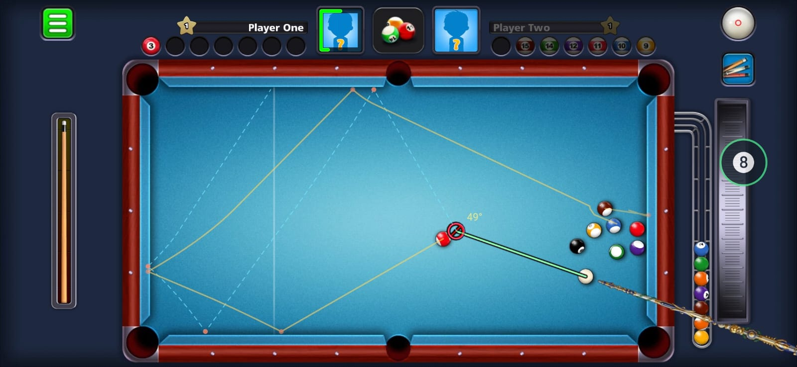
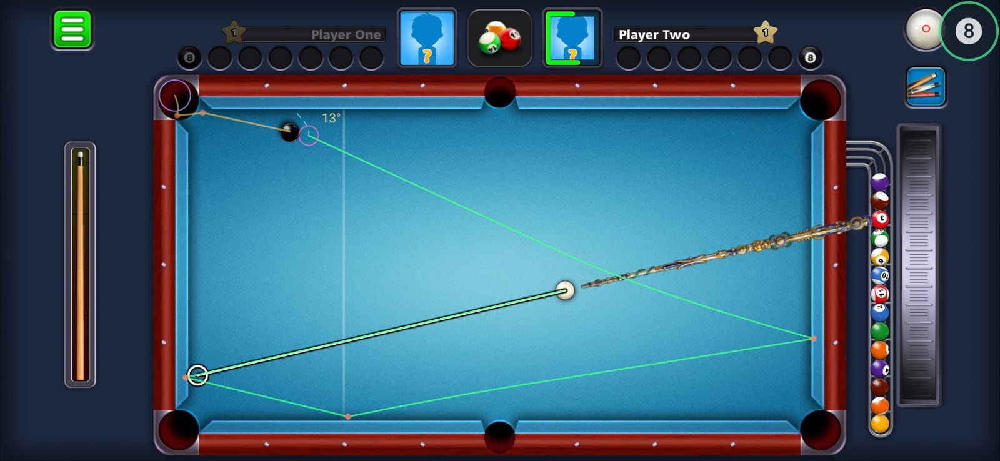

# 8 Ball Pool Aim Assistant

An Android app that reads a pool game off the screen and draws the predicted shot
on top of it. It runs as a system overlay, so the game carries on underneath and
never knows it is there.

Built as a proof of concept for offline practice tables. It is not affiliated with
Miniclip. It does not touch the game process, its files, or its network traffic.
Everything it knows, it gets from pixels.

**It is not 100% accurate and there is still work to do on it.** Everything comes
from reading the screen, so a ball the detector misplaces by a pixel or two moves
the far end of a long trajectory by a lot more than that. The first contact and
the tangent line are the parts to trust. Long cushion chains are an estimate, spin
is not read at all, and the colour thresholds were tuned on one table skin.
Treat it as a good indication of where the balls are going, not as a guarantee.



Green is the cue ball, amber is whatever it sets moving, the ring is the ghost
ball, and the number is the cut angle. Rings on the pockets mark the ones a ball
is going into. Everything except the overlay in that picture is the game.

| | |
|---|---|
|  |  |
|  |  |

## Download

If you just want to use it, take the APK and skip the whole build:

**[Download the APK](https://github.com/obaskly/8-ball-pool-aim-assistant/releases/latest/download/aim-assistant-arm64-v8a.apk)**
(about 25 MB, latest release)

It is a 64 bit ARM build, which covers essentially every phone sold in the last
several years, and it needs Android 7.0 or newer.

Installing it:

1. Download the file on your phone, or push it across with
   `adb install -r aim-assistant-arm64-v8a.apk`.
2. Open it. Android will say the file came from an unknown source, because it did.
   Allow installs from your browser or file manager when it asks.
3. Play Protect may warn you as well. It flags anything it has not seen before,
   and an APK off GitHub with a hundred downloads is by definition something it
   has not seen before. Install anyway if you are happy to.

The releases page also carries the checksum, so you can confirm the file you got
is the file that was built:

```bash
sha256sum aim-assistant-arm64-v8a.apk
```

Everything below is for building it yourself.

## How it works

Three pieces in a loop, running about fifteen times a second.

### 1. Read the screen

A foreground service mirrors the display through `MediaProjection` into an
`ImageReader`, and a Kotlin analyser (`TableAnalyzer.kt`) does the vision work
directly on the raw buffer:

* Work out what the cloth looks like, then segment it. The game sells table
  skins and they are not variations on a theme — blue, teal, green, brown and a
  near-black one all ship — so there is no one colour to test for. What holds
  across all of them is the *shape* of the colour, and that is what the detector
  matches: one hue, shaded from the rails to the light in the middle and washed
  out by that light rather than turned by it. See **Reading any table** below.
* Take the playfield rectangle as the median first and last cloth pixel across
  every scanline of the cloth region connected to the middle of the table.
* Flood fill everything that is not cloth inside that rectangle. Each blob is
  filtered on area, fill ratio and aspect, which throws away HUD fragments,
  trajectory lines and the notches at the pocket mouths.
* Classify each ball as cue, eight, stripe or solid from its white fraction and
  mean brightness.
* Sweep an annulus around the cue ball to find the game's own aim guideline, and
  read the power meter on the left edge.

The guideline is the useful part. The game has already solved the aim, so rather
than guessing where the player is pointing, the detector reads the answer off the
screen and builds the prediction from there.

The meter down the left edge is read as a cue sitting in a slot, so what counts
is the y position of the ferrule rather than any fill level. Only the full power
end is fixed, so the app learns the other end the first time it watches a full
pull back.

Nothing is written to disk and nothing leaves the device. Frames go from
`ImageReader` to the analyser and are closed.

#### Reading any table

The first version of this tested for one colour, measured off one table skin. It
worked on that table and found nothing at all on any other, which from the
outside is indistinguishable from the app being broken.

What replaced it is a description rather than a colour. Split a pixel into a grey
part and a colour part. Shading the cloth scales the colour part, the light over
the table adds grey, and neither turns it — so every shade of one cloth lies
along a single ray out of the grey axis, and distance from that ray is what tells
cloth from a rail, a ball, or the chrome around the table. On the near-black skin
the ray has no direction at all, which comes out right on its own: the test
collapses to "barely any colour", which is what that cloth is.

Three details carry the rest of it:

* **A run along the ray, not the whole of it.** The floor separates the blue skin
  from the app's own navy chrome, which shares its hue exactly and is only less
  saturated. The ceiling keeps a blue ball on a blue table from reading as cloth.
* **Connected to the table.** Colour alone cannot separate the blue cloth from
  that chrome, so the rectangle is measured over the cloth reachable from the
  middle of the table. The rail runs between the two and answers no colour test,
  so the fill stops there.
* **The floor is chosen, not assumed.** How far down the ray to go is the one
  number that decides whether the mask stops at the cushion or runs on across the
  rail, and nothing in the frame says which case a given table is. So several are
  tried and the answer is picked by what it produces: a rectangle shaped like a
  pool table, holding as much cloth as any of the candidates manage. The table's
  proportions are the one thing about the frame known exactly, which makes them
  the honest thing to judge a guess by.

The guideline threshold is measured the same way and for the same reason. The
game draws its line as white *through* the felt, so what comes out depends on
what it crosses: 255 on the pale blue table, 184 on the teal one, and 185 on the
green one — where the cloth beside it reads 205 and is the brighter of the two. A
fixed floor high enough for one skin finds no line on the others.

All of this is learned once and kept. It is redone when the table has been
unreadable for a while, or on demand from either panel.

Measured against the frames in `docs/reference-frames/` and a set of captures of
the other skins, the playfield rectangle comes out within about two pixels in
a thousand on every one of them, cue ball and guideline included.

The detector has to avoid reading its own output, since screen capture records the
overlay along with the game. Every accent colour in the default theme sits below
the brightness threshold the aim sweep uses, so the overlay is invisible to it.
The one line bright enough to be picked up gets trimmed at the head by the scene
builder.

### 2. Predict the shot

Detected balls become a table in centimetres and go through the simulator in
`src/physics/sim.ts`. It steps at a fixed 200 Hz with continuous collision
detection, using the game's own constants rather than textbook pool physics:

| | |
|---|---|
| Table | 254 x 127 cm, ball radius 3.8 cm |
| Launch speed | `v = (1 - sqrt(1 - power)) * cuePower`, cuePower between 666 and 888.85 cm/s |
| Sliding | 196 cm/s2, until the ball catches up with its own spin |
| Rolling | 10.878 cm/s2 |
| Cushion | 0.804 restitution on the normal only, 0.4 friction on the tangent |
| Ball on ball | equal mass and elastic, so the 90 degree split, and the striker keeps its spin |
| Pockets | 8 cm radius, with the suction the game applies near the mouth |

Tracking spin separately from velocity is what makes the difference in practice.
The sliding phase covers roughly 987 cm, which is close to four table lengths, so
on a firm shot the cue ball is genuinely still sliding when it arrives and the
90 degree guideline holds exactly. On a soft shot it has already started rolling,
and the roll drags it forward after contact instead. The same simulator produces
both, because it is not assuming either one.

The table itself is a 46 point polygon with real pocket jaws, so balls bounce off
jaw corners the way they do in the game rather than off a plain rectangle.

### 3. Draw it

A second foreground service owns a transparent, always on top window and paints
the prediction there. Two services rather than one because from Android 14 a
foreground service may only do what its declared type allows, and combining them
would mean handing the drawing service capture rights it never uses.

Lines are shown while the game is drawing its own guideline, which is while you
are aiming, and clear within about a quarter of a second of you taking the shot.

A draggable chip sits on top of the game as well, and tapping it opens the
settings there — status, power, cue-ball roll, what the overlay draws — in a
third window, with a minimise button. That is a window rather than a trip back to
the app because Android drops the capture session on that round trip often enough
that changing one setting could cost a fresh consent dialog. The panel in the app
is still the complete one; the floating one carries what is worth changing
between shots, and has a button to open the other.

## Requirements

* Node 20 or newer, and npm
* JDK 17 or newer (21 works)
* Android SDK with platform 36 and build tools 36.x
* `adb` on your `PATH`
* A phone running Android 7.0 or newer

There is no need to install Gradle, the wrapper in `android/` pulls its own.

### Setting up the Android SDK

If you already use Android Studio, install "Android SDK Platform 36" and
"Android SDK Build-Tools 36" from the SDK Manager and skip ahead.

Without Android Studio, the command line tools are enough:

```bash
mkdir -p ~/Android/Sdk/cmdline-tools
cd ~/Android/Sdk/cmdline-tools
# grab commandlinetools-linux-*.zip from https://developer.android.com/studio#command-tools
unzip commandlinetools-linux-*.zip
mv cmdline-tools latest

export ANDROID_HOME=$HOME/Android/Sdk
export PATH=$PATH:$ANDROID_HOME/cmdline-tools/latest/bin:$ANDROID_HOME/platform-tools

sdkmanager --licenses
sdkmanager "platform-tools" "platforms;android-36" "build-tools;36.0.0"
```

Put the two `export` lines in your `~/.bashrc` so they stick.

## Build

```bash
git clone https://github.com/obaskly/8-ball-pool-aim-assistant.git
cd 8-ball-pool-aim-assistant
npm install
npm run apk
```

`npm run apk` runs the prebuild and then the Gradle release build, and prints the
path at the end:

```
android/app/build/outputs/apk/release/app-release.apk
```

Install it:

```bash
adb install -r android/app/build/outputs/apk/release/app-release.apk
```

The two steps separately, for when something goes wrong:

```bash
npx expo prebuild --platform android          # add --clean after editing app.json
cd android && ./gradlew assembleRelease
```

Or build straight onto a connected device:

```bash
npx expo run:android --variant release
```

The APK comes out around 66 MB because it packs native libraries for all four
ABIs. For your own phone, cut it to roughly a quarter of that:

```bash
cd android && ./gradlew assembleRelease -PreactNativeArchitectures=arm64-v8a
```

### Notes on the build

`android/` is generated by prebuild, so do not edit it by hand. Permissions come
from `plugins/withOverlayPermissions.js`, app config from `app.json`, and native
code from `modules/overlay-native/`. Anything you change under `android/` is gone
the next time prebuild runs.

Release builds are signed by `plugins/withReleaseSigning.js`. It looks for four
Gradle properties, and falls back to the SDK debug key when they are missing, so a
fresh clone builds without any setup. To sign with your own key instead:

```bash
keytool -genkeypair -v -keystore release.keystore -alias my-alias \
  -keyalg RSA -keysize 4096 -validity 10000
```

Then put the credentials in `~/.gradle/gradle.properties`, outside the repository:

```properties
AIM_RELEASE_STORE_FILE=/absolute/path/to/release.keystore
AIM_RELEASE_STORE_PASSWORD=...
AIM_RELEASE_KEY_ALIAS=my-alias
AIM_RELEASE_KEY_PASSWORD=...
```

Keep the keystore and that file off GitHub. `*.keystore` is already in
`.gitignore`. If you lose the key you cannot ship an update that Android will
accept over an existing install.

This will not run in Expo Go. It needs a Kotlin module and manifest entries that
Expo Go cannot provide.

### Checks

```bash
npm run typecheck     # tsc --noEmit
npm test              # vitest, 116 tests
```

## First run

1. Open the pool game, start an offline match, then switch back to the app.
2. Tap **Grant draw-over permission** and enable "Display over other apps". The
   app re-reads the permission when it comes back to the foreground, so tap the
   button again once you return.
3. Tap **Start reading table** and accept Android's screen recording prompt. Two
   quiet notifications appear, each with a Stop action.
4. Switch to the game and aim. Tap the floating chip to open the settings on top
   of the game; **Minimise** puts them away again and leaves the chip.

The **Reading** row in both panels says what the detector is doing. `ok` is the
good one. `no cue ball` means the cue is off the table or under a menu, `table not
visible` means something is covering it, `no table colour` means it has not found
a table to read a colour off yet, and an aspect ratio means the view is not head
on. **Table colour** shows the cloth it is currently matching, which is the first
thing to look at on a skin it has never seen; **Re-read colour** makes it look
again.

Aim and power both follow the game by default, and both can be driven from sliders
instead. Touches pass through the overlay unless you switch that off.

Android will not resume a stopped capture session, so stopping and starting again
always re-shows the consent dialog. That is the OS, not the app.

## Layout

```
App.tsx                     control panel and the per frame loop
app.json                    Expo config, registers the plugin
plugins/                    injects the overlay and foreground service permissions
modules/overlay-native/     local Expo module, autolinked, not published
  android/.../OverlayService.kt    overlay window
  android/.../CaptureService.kt    MediaProjection, ImageReader, VirtualDisplay
  android/.../TableAnalyzer.kt     cloth, balls, aim line, power meter
src/physics/                pure TypeScript, no React and no native imports
  gamePhysics.ts            the constants, with their derivations
  table8bp.ts               table polygon, pockets, cm to pixel mapping
  sim.ts                    the stepper
  simEngine.ts              simulation results into the shape the overlay speaks
src/vision/                 detections into a table, smoothing, latching
src/calibration/            measured table proportions
src/overlay/                prediction into draw commands
docs/reference-frames/      the frames the calibration was measured from
docs/screenshots/           the overlay running
```

## Limits

* Geometry was measured at 2340x1080. A different aspect ratio needs the offset
  and scale nudges in the calibration panel, because the game letterboxes rather
  than stretching. Table colour is learned per table and needs nothing.
* The Lucky Shot mini-game reads its table but loses the cue ball there: it
  carries a marker large enough to hollow the ball out.
* No english. The simulator handles side spin but nothing reads the spin selector,
  so every shot is modelled as struck through the centre.
* Long chains drift. The first contact and the tangent line are the accurate part,
  and that is what most of a shot depends on anyway.
* Screen capture costs a frame or two of latency. Raising the fps slider helps if
  the ms per frame figure in the status line has room in it.

## Contributing

Improvements are welcome, and there is plenty to improve. Open a pull request.
The parts most worth attention:

* Reading the spin selector, so draw and follow stop being ignored. The simulator
  already handles side spin, nothing feeds it.
* The cue ball on the Lucky Shot table, where the marker painted on it is large
  enough to hollow the ball out in the distance transform.
* Anything that cuts latency between the frame arriving and the lines landing.

Run `npm run typecheck` and `npm test` before opening the pull request.

## Credit

The physics constants and the shape of the simulation came from
[PoolPredictor](https://github.com/OiwexO/PoolPredictor), which recovered them
from the game binary. [8BallPool](https://github.com/jonathansilva/8BallPool) was
useful for the overlay side. The vision pipeline, the Expo module and everything
in `src/` here are original.
